# Calendar maker (.ics)

Bonjour et bienvenue sur la documentation de Calendar maker ! Avant toute chose, je vous remercie d'utiliser Calendar maker. C'est un de mes premiers projets en JavaScript donc si vous trouvez des choses dans le code source qui vous paraissent perfectible, n'hésitez pas à créer un *issue* ou à directement contribuer.

## But de cette application

Cette application a pour but d'aider les étudiants de l'UTBM à pouvoir importer leur emploi du temps fourni par leur école sur leur gestionnaire d'agenda préféré (zimbra, google agenda, outlook, iCloud, etc.) en seulement quelques clics.

## Utilisation

Pour importer votre emploi du temps UTBM, suivez le guide d'utilisation ci-dessous.
> :warning: Cette application est avant tout pensée pour être utilisée sur ordinateur. Il est également possible de l'utiliser sur téléphone portable mais l'import sur l'agenda du téléphone peut être plus compliqué. Je propose une solution d'import à la fin de ce tutoriel, mais elle n'est sûrement pas pafaite.

### Téléchargement du fichier ics

1. Tout d'abord il faut copier l'emploi du temps avec un **ctrl + c** bien placé (**Commande + c** sur mac évidemment).
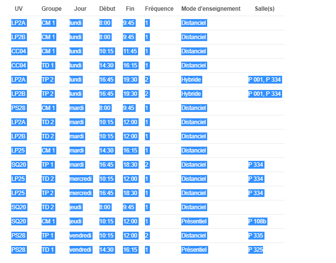

2. Il faut ensuite se rendre sur le site  et lâcher ton meilleur **ctrl + v** dans l'encart prévu à cet effet.
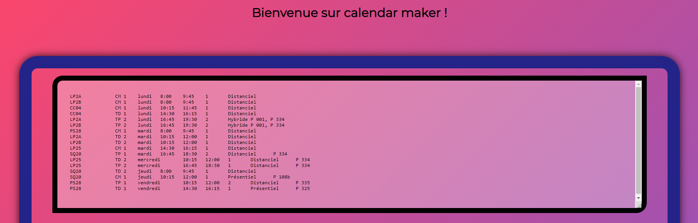

3. Il faut ensuite indiquer quand auront lieu les vacances scolaires et quand s'achève le semestre. Les calendriers universitaires sont disponibles à cette adresse : .
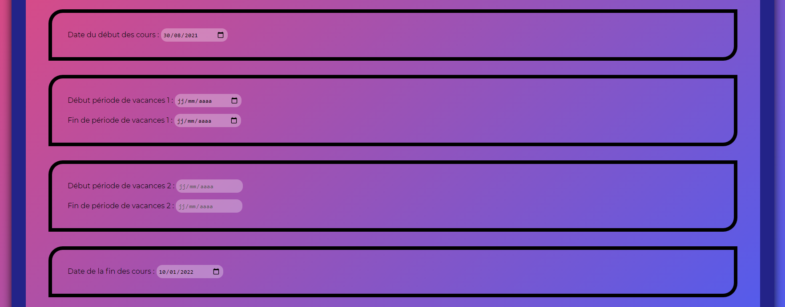

4. Appuie sur **J'ai fini !**. 

5. **(Optionnel)** Si tu as des cours de fréquence 2, le site te demandera de renseigner la première occurence de ce cours. :warning: Si il s'agit de deux demi-uv, mets la même date de début pour les deux.

6. Cliques sur **Téléchargez votre emploi du temps** et c'est parti. Tu auras entre tes mains le précieux fichier ics !

> :warning: Si tu t'es rendu compte que tu as raté une de ces étapes, je suis désolé mais il va falloir tout reccommencer en lâchat un bon vieux **F5**. Bon courage :heart: 

### Import sur différentes plateforme

Maintenant que le fichier ics est en ta possession, il va falloir l'importer sur ton gestionnaire de calendriers préféré ! J'ai fait une liste non-exhaustive de mes applications préférées. Si celui que tu cherches à utiliser n'est pas dans cette liste, n'hésite pas à me contacter pour qu'on le rajoute.

#### Bonnes pratiques

Avant de commencer à lister les différentes applications, pense à toujours créer un calendrier à part pour emploi du temps. Si tu importes ton fichier ics sur un calendrier déjà existant et que tu veux supprimer les événements générés par *Calendar-maker* pour une raison x ou y, il faudra que tu supprimes chaque créneau un à un. Avec un agenda dédié, il te suffit de supprimer/ te désabonner du calendrier où tu as mis tes créneaux pour ne plus les voir.

#### Zimbra

Le classico Zimbra. TOut étudiant à l'UTBM possède une boîte Zimbra, c'est parfait pour tout centraliser au même endroit.

1. On crée d'abord un nouveau calendrier pour éviter tout souci.
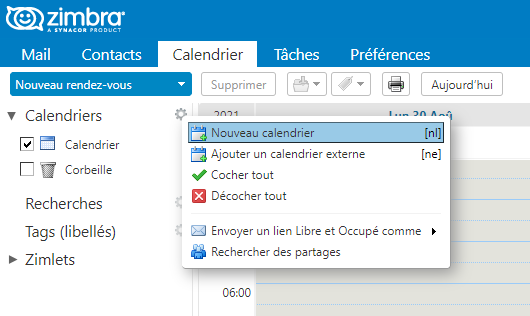

2. Vas Dans Préférences > Importer/Exporter.
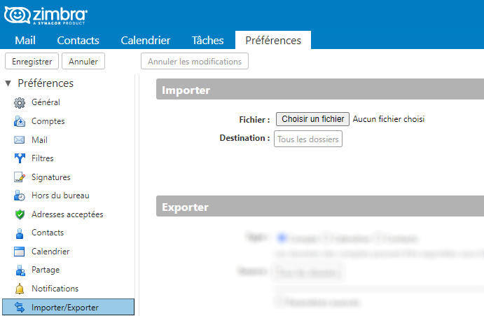

3. Choisis le fichier qui vient d'être généré par le site.
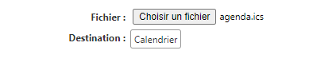

4. Choisis le calendrier que tu viens de créer et cliques puis cliques sur le bouton **importer**.
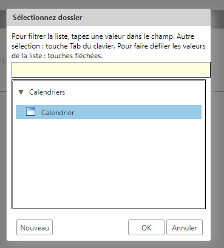

5. Et voilà ton agenda est disponible sur Zimbra !

#### Google agenda

Pour les irréductibles gaulois qui ne jurent que par Google.

1. On crée un nouvel agenda ici :
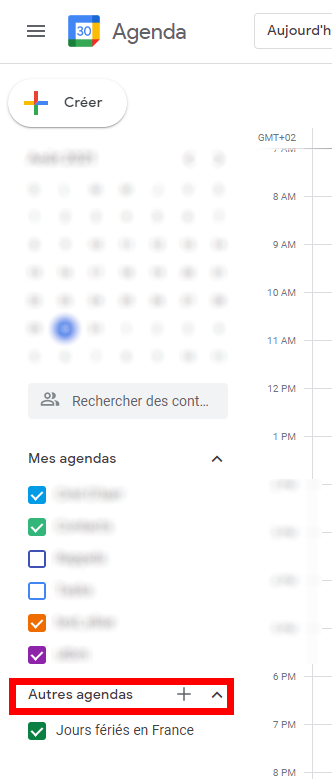

2. On choisit **Importer** également au même endroit :

3. On choisit le fichier que l'on veut importer.
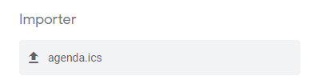

4. On choisit l'agenda qu'on vient de créer sur google agenda et on clique sur **Importer**.
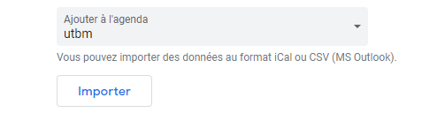

5. Et voilà, ton emploi du temps est disponible sur google agenda !

#### Microsoft Outlook

Pour les Microsoft lovers.

1. On crée un nouvel agenda en cliquant d'abord sur la petit icône de calendrier puis sur le bouton **Ajouter un calendrier** puis en choisissant de créer un calendirer vide.
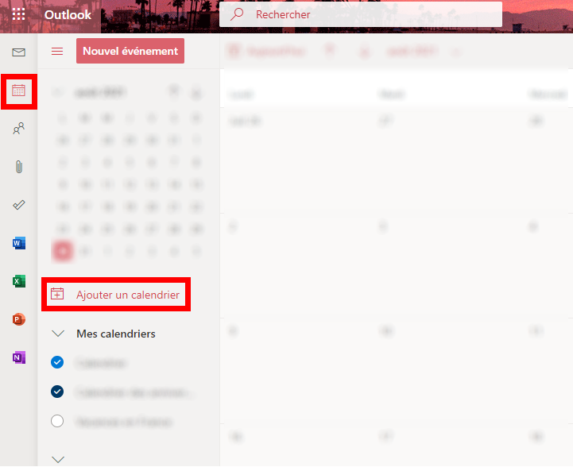

2. Appuie à nouveau sur le bouton **Ajouter un calendrier** puis choisis le fichier que tu veux importer.
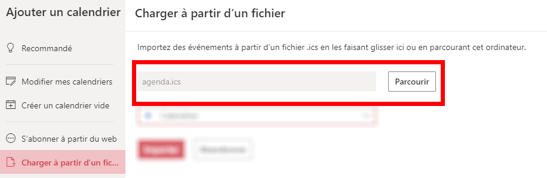

3. Sélectionne le calendrier que tu as créé il y a quelques instants.
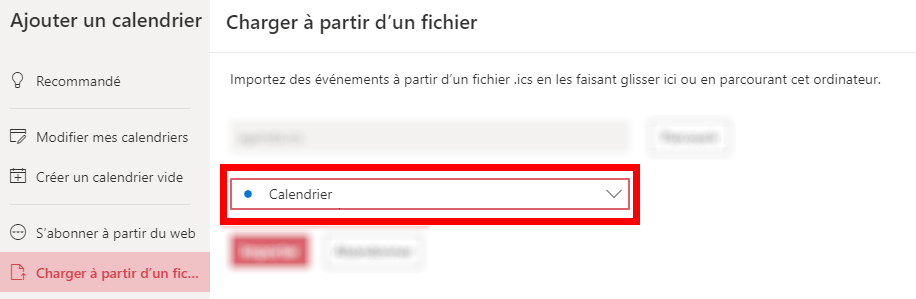

4. Appuie sur le bouton **Importer**.
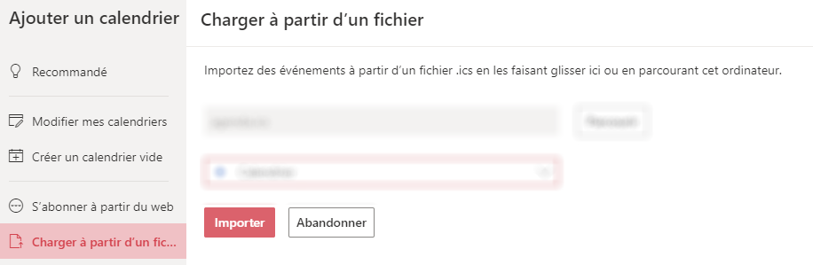

5. Et voilà, ton emploi du temps est disponible sur Outlook !

#### Une solution pour les téléphone portable

> Work in progress :construction: